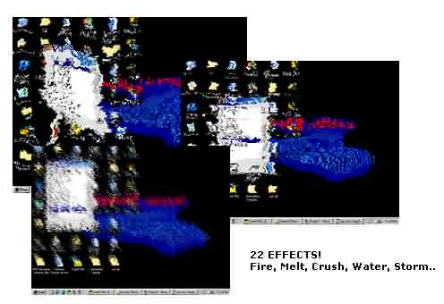



## Unbelievable Screen Effects 3\!

### Description

Unbelievable Screen effects!

Make your screen powder, melt, evaporate..

REALLY AMAZING. 14 new effects added!

3rd release. JUST A PAGE OF SIMPLE CODE!

See it for yourself!
 
### More Info
 

             |
---                |---
**Submitted On**   |2003-05-28 14:20:06
**By**             |[Kailash Nadh](https://github.com/Planet-Source-Code/PSCIndex/blob/master/ByAuthor/kailash-nadh.md)
**Level**          |Intermediate
**User Rating**    |4.9 (237 globes from 48 users)
**Compatibility**  |VB 3\.0, VB 4\.0 \(16\-bit\), VB 4\.0 \(32\-bit\), VB 5\.0, VB 6\.0
**Category**       |[Graphics](https://github.com/Planet-Source-Code/PSCIndex/blob/master/ByCategory/graphics__1-46.md)
**World**          |[Visual Basic](https://github.com/Planet-Source-Code/PSCIndex/blob/master/ByWorld/visual-basic.md)
**Archive File**   |[Unbelievab1593295282003\.zip](https://github.com/Planet-Source-Code/kailash-nadh-unbelievable-screen-effects-3__1-45778/archive/master.zip)

